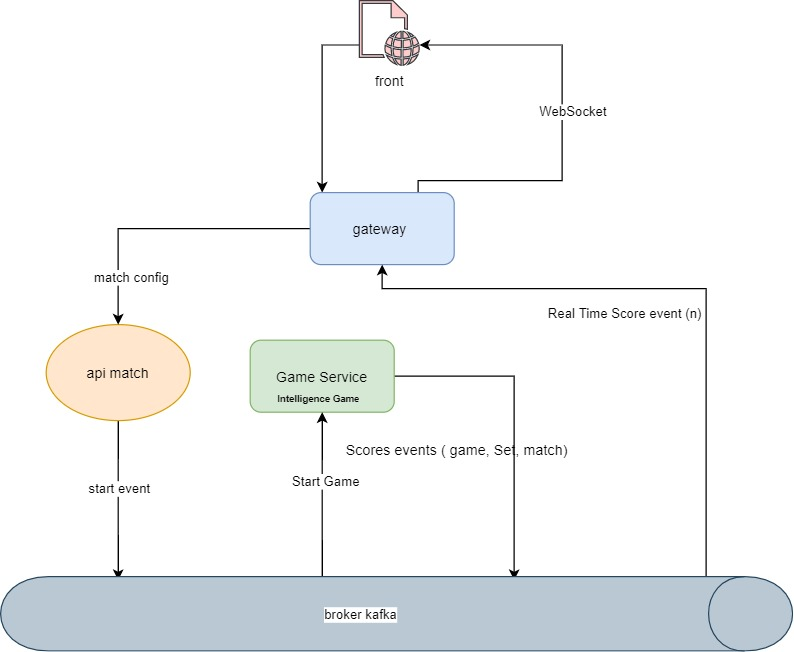

# tennis-kata

[](https://travis-ci.com/aboushaheed/tennis-kata)

**the kata**
> As a tennis referee
          I want to manage the score of a game of a set of a tennis match between 2 players with simple Game rules
          In order to display the current Game score of each player
  
          Rules details:
                 •    The game starts with a score of 0 point for each player
                 •    Each time a player win a point, the Game score changes as follow:
                      0 -> 15 -> 30 -> 40-> Win game
> As a tennis referee
          I want to manage the specific of the rule DEUCE at the end of a Game
          In order to display the current Game score of each player
  
          Rules details:
                 •    If the 2 players reach the score 40, the DEUCE rule is activated
                 •    If the score is DEUCE , the player who  win the point take the ADVANTAGE
                 •    If the player who has the ADVANTAGE win the  point, he win the game
                 •    If the player who has the ADVANTAGE looses the point, the score is DEUCE
> As a tennis referee
         I want to manage the score of a set of a tennis match between 2 players
         In order to display the current Game (SPRINT 1) & Set score of each player
  
         Rules details:
               •    The set starts with a score of 0 Game for each player
               •    Each time a player win a Game (see SPRINT 1), the Set score changes as follow:
                     1 -> 2 -> 3 -> 4 -> 5 -> 6 (-> 7)
               •    If a player reach the Set score of 6 and the other player has a Set score of 4 or lower, the player win the Set
               •    If a player wins a Game and reach the Set score of 6 and the other player has a Set score of 5, a new Game must be played and the first player who reach the score of 7 wins the match
  
>As a tennis referee
        I want to manage the specific of the rule of Tie-Break at the end of the Set
        In order to display the current Game, Set score & Tie-Break score of each player
 
        Rules details:
              •    If the 2 players reach the score of 6 Games , the Tie-Break rule is activated
              •    Each time a player win a point, the score changes as follow:
                     1 -> 2 -> 3 -> 4 -> 5 -> 6 -> 7 (-> 8-> 9-> 10-> …)
              •    The Tie-Break ends as soon as a player gets a least 7 points and 2 points more than his opponent
              •    The player who wins the Tie-Break wins the Set and the match


### Architecture
> I use event driven model by introducing a kafka broker as shown bellow, the frontend use React ( to be performed)
> 



### How to use
### for Tennis-kata application
> you have to run docker-compose for Kafka and kafdrop if you want to monitor topics
> specify different ports for you apps in VM options ( -Dserver.port=8081 ) for example
> use environment variables as KAFKA_HOST=localhost;KAFKA_TOPIC=GAME_TOPIC;KAFKA_GROUP=TENNIS
> you have a Dockerfile if you use docker
>
```yaml
version: "2"
services:
  kafdrop:
    image: obsidiandynamics/kafdrop
    restart: "no"
    ports:
      - "9000:9000"
    environment:
      KAFKA_BROKERCONNECT: "kafka:29092"
      JVM_OPTS: "-Xms16M -Xmx48M -Xss180K -XX:-TieredCompilation -XX:+UseStringDeduplication -noverify"
    depends_on:
      - "kafka"
  kafka:
    image: obsidiandynamics/kafka
    restart: "no"
    ports:
      - "2181:2181"
      - "9092:9092"
    environment:
      KAFKA_LISTENERS: "INTERNAL://:29092,EXTERNAL://:9092"
      KAFKA_ADVERTISED_LISTENERS: "INTERNAL://kafka:29092,EXTERNAL://localhost:9092"
      KAFKA_LISTENER_SECURITY_PROTOCOL_MAP: "INTERNAL:PLAINTEXT,EXTERNAL:PLAINTEXT"
      KAFKA_INTER_BROKER_LISTENER_NAME: "INTERNAL"
      KAFKA_ZOOKEEPER_SESSION_TIMEOUT: "6000"
      KAFKA_RESTART_ATTEMPTS: "10"
      KAFKA_RESTART_DELAY: "5"
      ZOOKEEPER_AUTOPURGE_PURGE_INTERVAL: "0"
```
run that
```shell script
docker-compose up -d
```

